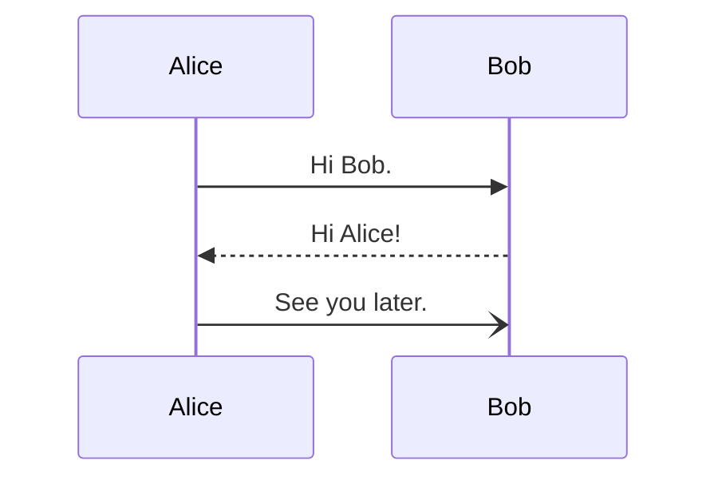

# Test Cheatsheet

## Section

|**Command**|**Function**|
|-|-|
|⌘a|Select All|
|⌘⇧x|Nuke the site from orbit|

## Another section

|**Command**|**Function**|
|-|-|
|⇧⌘f|Find in project|
|⌘f|Find|

## Inline code & mermaid diagrams

### Python

```python
print("Hello World!")

def add(a, b):
    return a + b
```

### Rust

```rust
fn main() {
    println!("Hello World!");
}
```

### Diagrams



```fletcher
#set text(fill: white)
#let colors = (maroon, olive, eastern)

#diagram(
  edge-stroke: 1pt,
  node-corner-radius: 5pt,
  edge-corner-radius: 8pt,
  mark-scale: 80%,

  node((0,0), [input], fill: colors.at(0)),
  node((2,+1), [memory unit (MU)], fill: colors.at(1)),
  node((2, 0), align(center)[arithmetic & logic \ unit (ALU)], fill: colors.at(1)),
  node((2,-1), [control unit (CU)], fill: colors.at(1)),
  node((4,0), [output], fill: colors.at(2), shape: fletcher.shapes.hexagon),

  edge((0,0), "r,u,r", "-}>"),
  edge((2,-1), "r,d,r", "-}>"),
  edge((2,-1), "r,dd,l", "--}>"),
  edge((2,1), "l", (1,-.5), marks: ((inherit: "}>", pos: 0.65, rev: false),)),

  for i in range(-1, 2) {
    edge((2,0), (2,1), "<{-}>", shift: i*5mm, bend: i*20deg)
  },

  edge((2,-1), (2,0), "<{-}>"),
)
```

```fletcher
#import fletcher.shapes: diamond

#diagram(
	node-stroke: 1pt,
	node((0,0), [Start], corner-radius: 2pt, extrude: (0, 3)),
	edge("-|>"),
	node((0,1), align(center)[
		Hey, wait,\ this flowchart\ is a trap!
	], shape: diamond),
	edge("d,r,u,l", "-|>", [Yes], label-pos: 0.1)
)
```

```cetz
#canvas({
  import draw: *

  ortho(y: -30deg, x: 30deg, {
    on-xz({
      grid((0,-2), (8,2), stroke: gray + .5pt)
    })

    // Draw a sine wave on the xy plane
    let wave(amplitude: 1, fill: none, phases: 2, scale: 8, samples: 100) = {
      line(..(for x in range(0, samples + 1) {
        let x = x / samples
        let p = (2 * phases * calc.pi) * x
        ((x * scale, calc.sin(p) * amplitude),)
      }), fill: fill)

      let subdivs = 8
      for phase in range(0, phases) {
        let x = phase / phases
        for div in range(1, subdivs + 1) {
          let p = 2 * calc.pi * (div / subdivs)
          let y = calc.sin(p) * amplitude
          let x = x * scale + div / subdivs * scale / phases
          line((x, 0), (x, y), stroke: rgb(0, 0, 0, 150) + .5pt)
        }
      }
    }

    on-xy({
      wave(amplitude: 1.6, fill: rgb(0, 0, 255, 50))
    })
    on-xz({
      wave(amplitude: 1, fill: rgb(255, 0, 0, 50))
    })
  })
})
```
