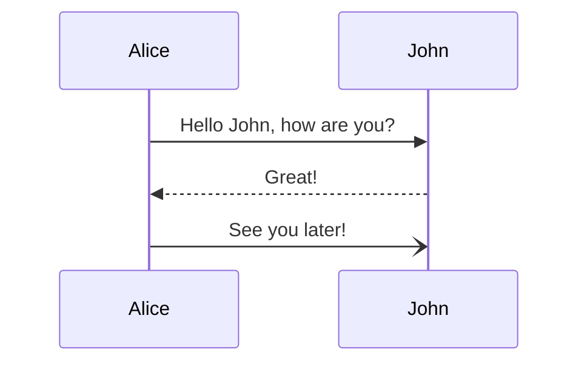

# Test Cheatsheet

## Section

|**Command**|**Function**|
|-|-|
|⌘a|Select All|
|⌘⇧x|Nuke the site from orbit|

## An image section


## Another section

|**Command**|**Function**|
|-|-|
|⇧⌘f|Find in project|
|⌘f|Find|

## Some code

### Python

```python
print("Hello World!")

def add(a, b):
    return a + b
```

### Rust

```rust
fn main() {
    println!("Hello World!");
}
```

## Inline diagram?

Sadly doesn't render.


