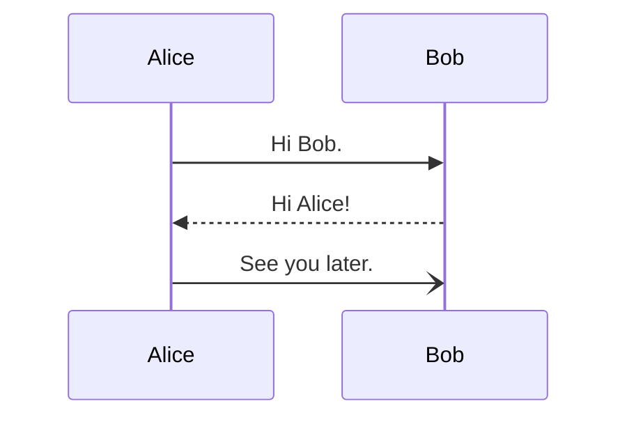

# Test Cheatsheet

## Section

|**Command**|**Function**|
|-|-|
|⌘a|Select All|
|⌘⇧x|Nuke the site from orbit|

## Another section

|**Command**|**Function**|
|-|-|
|⇧⌘f|Find in project|
|⌘f|Find|

## Inline code & mermaid diagrams

### Python

```python
print("Hello World!")

def add(a, b):
    return a + b
```

### Rust

```rust
fn main() {
    println!("Hello World!");
}
```

### Diagrams



```fletcher
#set text(fill: white)
#let colors = (maroon, olive, eastern)

#diagram(
  edge-stroke: 1pt,
  node-corner-radius: 5pt,
  edge-corner-radius: 8pt,
  mark-scale: 80%,

  node((0,0), [input], fill: colors.at(0)),
  node((2,+1), [memory unit (MU)], fill: colors.at(1)),
  node((2, 0), align(center)[arithmetic & logic \ unit (ALU)], fill: colors.at(1)),
  node((2,-1), [control unit (CU)], fill: colors.at(1)),
  node((4,0), [output], fill: colors.at(2), shape: fletcher.shapes.hexagon),

  edge((0,0), "r,u,r", "-}>"),
  edge((2,-1), "r,d,r", "-}>"),
  edge((2,-1), "r,dd,l", "--}>"),
  edge((2,1), "l", (1,-.5), marks: ((inherit: "}>", pos: 0.65, rev: false),)),

  for i in range(-1, 2) {
    edge((2,0), (2,1), "<{-}>", shift: i*5mm, bend: i*20deg)
  },

  edge((2,-1), (2,0), "<{-}>"),
)
```

```fletcher
#import fletcher.shapes: diamond

#diagram(
	node-stroke: 1pt,
	node((0,0), [Start], corner-radius: 2pt, extrude: (0, 3)),
	edge("-|>"),
	node((0,1), align(center)[
		Hey, wait,\ this flowchart\ is a trap!
	], shape: diamond),
	edge("d,r,u,l", "-|>", [Yes], label-pos: 0.1)
)
```
